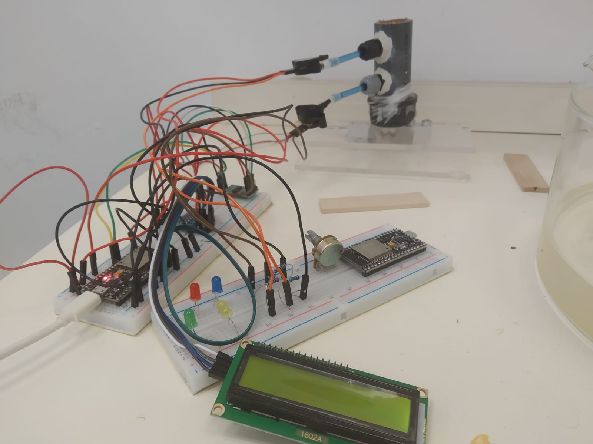

# מבוא

לקרקעות שונות יש תכונות המשתנות לפי אופי הקרקע. שתיים מהתכונות האלו הן תאחיזת מים ומוליכות הידראולית.

תאחיזת מים מתארת את היכולת של הקרקע להחזיק מים תחת לחץ מטריצי מסוים, כדי לאפיין את תאחיזת המים בקרקע צריך למדוד את הלחץ בנקודת הקרקע ואת תכולת הרטיבות שלה. 

מוליכות הידראולית מתארת את היכולת של הקרקע להעביר מים, כדי לאפיין את המוליכות ההידראולית של הקרקע צריך למדוד את הפרש הלחצים בין שתי נקודות בעלות מרחק ידוע ואת שטף ההתאדות מהקרקע. באמצעות נתונים אלו ניתן לחשב את המוליכות ההידראולית על פי משוואת בקינגהאם דרסי לזרימה אי רוויה. 

# מטרות

בניית מערכת שתאפשר:

-    חישוב המוליכות ההידראולית של המים בקרקע. 

-    חישוב תכולת הרטיבות של הקרקע לאורך זמן, יצירת עקום תאחיזת מים. 

# חשיבות

תכונות המוליכות ההידראולית ועקום תאחיזה מתארים את זרימת המים בקרקע. והנתון הזה חשוב ביותר מכיוון שהוא מאפשר לדעת ערכים מספרים למודלי זרימת מים וכך מסייע בניהול ממשק השקיה, איך כמה ומתי להשקות את הקרקע עבור סביב האופטימלית לצמחים. בנוסף, זרימת המים בקרקע מאפשרת להבין את תנועת הדשן בקרקע ואת תנועת המזהמים בקרקע וזה בעל חשיבות רבה בהיבט הסביבתי.

# שיטות

*ציוד אלקטרוני:*

1. Breadboard
2. ESP32
3. MPX5100DP חיישן לחץ 
4. ADS1115 דיוק ורזולוציה גבוהה לחיישן לחץ
5. Load cell with xfw-hx711 משקל
6. i2c 16x2 lcd מסך 
7. jumpers חיבורים חשמליים 
8. נגדים

באמצעות ה Breadboard וה- jumpers חיברנו את שני חיישני הלחץ דרך ADS, ואת המשקל והמסך לצ'יפ ESP32. כדי לתת ל ADS את המתח שהוא צריך מבלי לפגוע בצ'יפ נעזרנו בנגדים שיקלו מעומס המתח לאחר ADS. 

 

*ציוד ניסויי:*

1. צינור 3 ס"מ קוטר 8 ס"מ אורך
2. 2 טנסיומטרים + 2 מזרקים
3.  צינוריות דקות
4. קרקע 

באמצעות צינוריות חיברנו כל אחד מזנבות הטנסיומטרים אל מזרק, מילאנו כלי במים, הכנסנו את ראש הטנסיומטר אל תוך המים ומשכנו את המזרק בכוח, בכדי שהואקום לא ימשוך את המזרק חזרה נעזרנו בכפיסי עץ שימנעו מהמזרק להיטרק. במצב זה, כאשר ראשי הטנסיומטרים נמצאים בתוך המים ויש את הואקום מהמזרק שגורם למים לחלחל ולמלא את נימי הטנסיומטרים, השארנו את הטנסיומטרים למשך 24-72 שעות. 

קדחנו במרכז הצינור שני חורים במרחק 3 ס"מ אחד מהשני, באמצעות מברזה איפשרנו הברגה של פקקים דרכם נכניס את הטנסיומטרים ונהדק אותם כך שייאטם הפתח לנוזלים. 

 

 מילאנו את הצינור בקרקע מסוג חמרה והנחנו בתוך כלי עם מים במשך מספר שעות כך שגם הקרקע תורווה. 

לאחר הרווית הטנסיומטרים והקרקע חיברנו את קצות הטנסיומטרים בעזרת צינוריות אל חיישני הלחץ, הכנסנו אותם אל עמודת הקרקע והתחלנו את הניסוי. 

 

*שיטות:*

[Arduino IDE][arduino_code] תוכנה לכתיבת קוד על הצ'יפ. 

ThingSpeak שרת אינטרנטי לאיסוף נתונים. 

[Jupiter notebook][jupiter_code] תוכנה לעיבוד הנתונים שנאספו. 

משוואת בקינגהאם דרסי: 

כאשר: 

Q	ספיקה

A	שטח החתך

k	מוליכות הידראולית

Ψ	פוטנציאל לחץ

z∆	המרחק בין הטנסיומטרים 

# מהלך הניסוי - מה שעשינו בפועל

 במשך עשרה ימים העמדנו את עמודת הקרקע על המשקל מחוברת לחיישני הלחץ כך שיימדד המשקל המשתנה בעקבות אידוי של עמודת הקרקע ובנוסף חיישני הלחץ ימדדו את הלחץ בקרקע דרך הטנסיומטרים. הנתונים שנמדדו, הועלו כל כ 40 שניות ל ThingSpeak, שם נאספו הנתונים. בתום הניסוי, על סמך הנתונים שנאספו בנינו את עקום התאחיזה ותוך שימוש במשוואת בקינגהאם דרסי חילצנו את המוליכות ההידראולית. 

# תוצאות ודיון בתוצאות

[*עקום תאחיזה*][soil water characteristic] 

ציר X  זה תכולת הרטיבות, ביטוי לכמות המים בקרקע, ציר Y זה העומד המטריצי, הלחץ המטריצי ביחידות ס"מ. עקום התאחיזה מציג הלחץ על המים כתלות בתכולת הרטיבות. ע"פ הגרף, ככל שתכולת הרטיבות יורדת כך גם העומד המטריצי יורד, ואף נהיה שלילי. המשמעות של זה היא שככל שהעומד המטריצי שלילי יותר בקרקע, כך מופעל לחץ יותר גדול על המים בקרקע ויותר מים יתאדו, מה שיוביל לירידה בתכולת הרטיבות בקרקע. כאשר מים יתאדו תחילה מהנקבובים הגדולים(בעלי רדיוס אקוויוולנטי גדול), וככל שהעומד המטריצי יהיה שלילי יותר אז מים יתאדו גם מהנקבובים הקטנים. 
 

[*מוליכות הידראולית*][hydraulic conductivity]

ציר X  זה תכולת הרטיבות, ביטוי לכמות המים בקרקע, ציר Y זה מוליכות הידראולית, כמה טוב הקרקע מוליכה את המים, ביחידות של ס"מ בשעה. הגרף מציג את המוליכות ההידראולית כתלות בתכולת הרטיבות. ע"פ הגרף, ככל שתכולת הרטיבות גבוהה יותר, המוליכות ההידראולית גבוהה יותר והמים ינועו יותר מהר בקרקע. 

בשני הגרפים ניתן לראות מגמה מאוד ברורה אך יש קפיצות ותזוזות תוך כדי המגמה הזו. לדעתנו, הסיבה לכך נובעת מחוסר דיוק של המשקל. חוסר הדיוק הזה בא לידי ביטוי בסטיה של המשקל באופן בלתי פוסק ואף בקפיצות של עשרות גרמים לעיתים רחוקות. הקפיצות המשמעותיות של המשקל גרמו לתכולת המים שנמדדה על סמך השינוי במשקל להראות ערכים קופצים ולכן גם בגרפים התקבלו הקפיצות האלו וערכים בלתי הגיוניים נוספים. 

לאחר השמטה של מספר קריאות שכללו את הקפיצות במשקל קבלנו את גרפים באופן ברור ונהיר יותר: 

 

 
נראה שהעקום תאחיזה מראה גרף לינארי, למעט נקודה שבה ϴ = 0.25 ואז יש שינוי בשיפוע הקו הלינארי.  בנוסף, ניתן לראות מגמה ברורה יותר של המוליכות ההידראולית. בתחילה, כאשר תכולת הרטיבות קטנה, יש ירידה מתונה במוליכות ההידראולית אך החל מתכולת רטיבות מסוימת, בערך כאשר ϴ = 0.1 אז יש ירידה חדה מאוד במוליכות ההידראולית. 

# סיכום ומסקנות

משני הגרפים האלו ניתן להגיע למסקנה שככל שיש יותר מים בקרקע אז זרימת המים תהיה יותר מהירה כי המים יזרמו גם דרך הנקבובים הגדולים, שמלאים כאשר הקרקע רוויה ומתאדים לפני הנקבובים הקטנים. 

# תודות

למנחה ד"ר נמרוד שוורץ, למתרגל ארז פויר ולכל האנשים הטובים בדרך שסייעו :) 

[arduino_code]: https://github.com/talea30/Agrotech/blob/main/project_final.ino
[jupiter_code]: https://github.com/talea30/Agrotech/blob/main/agrotech%20project.ipynb
[soil water characteristic]: https://github.com/talea30/Agrotech/blob/main/images/עקום%20תאחיזה.jpg
[hydraulic conductivity]: https://github.com/talea30/Agrotech/blob/main/images/מוליכות%20הידראולית.jpg

